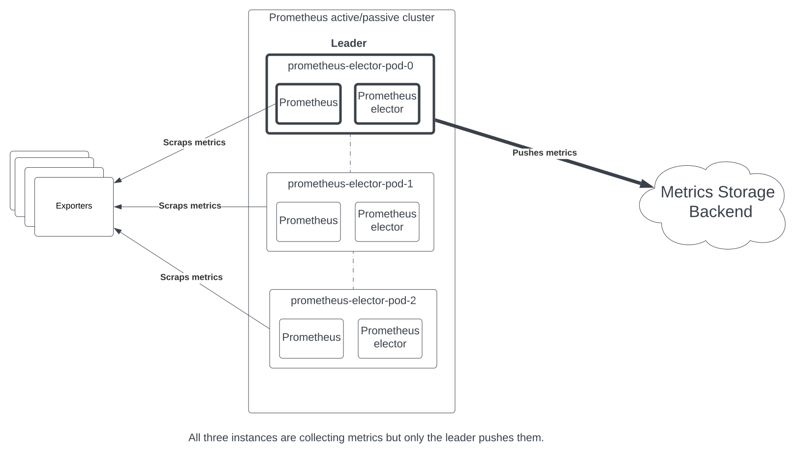
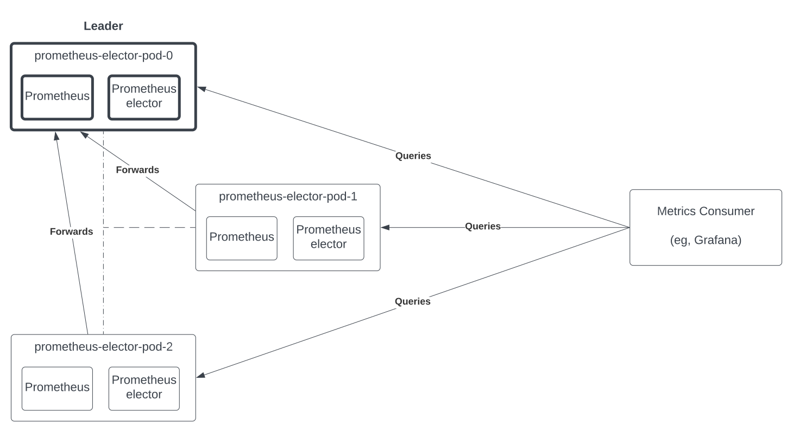

## prometheus-elector

`prometheus-elector` brings the ability of running a leader election between multiple [Prometheus](https://github.com/prometheus/prometheus) instances running in a Kubernetes cluster. It translates into the following features:

- Election Aware Configuration: prometheus-elector makes sure that only one instance in a replicated prometheus workload has a certain configuration overrides. For instance, it allows to only enable remote write on the leader.
- Election Aware Proxy: prometheus-elector can act as a reverse proxy that forwards all incoming HTTP requests to the leading instance. With that you can view your Prometheus cluster as a single instance.

The goal with prometheus-elector is to provide an easy to use, low maintenance, active-passive setup for Prometheus on Kubernetes.

What prometheus-elector is not:

- A "scalable" solution in term of time-series cardinality. With prometheus-elector you still have one Prometheus instance doing the job. Please look into other solutions (like [Mimir](https://github.com/grafana/mimir)) to achieve this.
- A "zero-downtime" solution. When the leading instance goes down, you still have a short period of time (seconds) before another replica takes over the leadership.
- A "portable" solution. It assumes running on Kubernetes, and relies on [Kubernetes leader election](https://kubernetes.io/blog/2016/01/simple-leader-election-with-kubernetes/).

### Use Case: Active Passive Prometheus Agent Setup

Prometheus (in agent mode) can be used to push metrics to a remote storage backend like [Mimir](https://grafana.com/oss/mimir/). While your storage backend might be highly available, you probably also want this property on the agent side as well.

One approach of this problem is to have multiple agents pushing the same set of metrics to the storage backend. This requires to run some sort of metrics deduplication on the storage backend side to ensure correctness.

Using `prometheus-elector`, we can instead make sure that only one Prometheus instance has `remote_write` enabled at any point of time and guarantee a reasonable delay (seconds) for another instance to take over when leading instance becomes unavailable. This brings the following advantages:

- It minimizes (avoids?) data loss
- It avoids running some expensive deduplication logic on the storage backend side
- It is also much more efficient in term of resource usage (RAM and Network) because only one replica does the scrapping and pushing samples



You can find the necessary configuration for this use case in the [example directory](./example/k8s/agent-values.yaml)

#### Running an Example of this Setup

You need [ko](https://github.com/ko-build/ko), `kubectl` and [k3d](https://github.com/k3d-io/k3d) and docker installed, from there run `make create_cluster install_agent_example`.

This command:

- Creates a k3d cluster
- Installs a storage backend Prometheus instance (in the `storage` namespace), configured to received metrics using the `remote_write` API.
- Installs a statefulset running two replicas of `prometheus-elector` and `prometheus` in agent mode. Only one of them will push metrics at any point of time.

### Use Case: Active Passive Prometheus

One issue running multiple Prometheus instances in paralle is that their dataset slightly diverges, which makes loadbalancing requests accross multiple instances difficult from a metrics consumer perspective. You'll need a metrics aware reverse proxy like [promxy](https://github.com/jacksontj/promxy) that aggregates the two sources to achieve this properly.

prometheus-elector takes a different approach and embeds a reverse proxy that forwards all received requests to the currently leading instance. While this solution doesn't provide load balancing, it allows, at minimal costs, to get consistent data independently of which replica is receiving the request initially.



You can find the necessary configuration for this use case in the [example directory](./example/k8s/ha-values.yaml)

#### Running an Example of this setup

You need [ko](https://github.com/ko-build/ko), `kubectl` and [k3d](https://github.com/k3d-io/k3d) and docker installed, from there run `make create_cluster install_ha_example`.

This command:

- Creates a k3d cluster
- Installs a statefulset running two replicas of `prometheus-elector` and `prometheus`.

From there you can port forward to one of the Prometheus pods (`k port-forward service/prometheus-elector-dev-leader 9095:80`) and start hitting the API through the port 9095 of the pod.

### How it Works?

It is implemented using a sidecar container that rewrites the configuration and injects `remote_write` rules in the configuration when elected leader. The setup is very similar to the usual [configmap-reloader](https://github.com/jimmidyson/configmap-reload) sidecar in Kubernetes deployment.

The prometheus-elector container then run a [Kubernetes leader election](https://kubernetes.io/blog/2016/01/simple-leader-election-with-kubernetes/) and an API server.

#### Election Aware Configuration

prometheus-elector accepts a configuration composed by two major sections:

- The `follower` section indicates the Prometheus configuration to apply in follower mode. This configuration is always applied.
- The `leader` section indicates the changes to apply to the follower configuration when the instance is in elected leader. Please note that those changes gets "appended" to the follower configuration.

Both those sections have the same model that the Prometheus configuration.

When a replica is elected leader, prometheus-elector generates a new configuration file that carries the follower configuration merged with the override values provided under the `leader` section. And then tells Prometheus to reload its configuration using its lifecycle management API. If the replica is follower, only the follower section is generated, without the `leader` overrides.

Here's an example that enables a `remote_write` target only when leader.

```yaml
# configuration applied when the instance is only follower.
follower:
  scrape_configs:
  - job_name:       'some job'
    scrape_interval: 5s
    static_configs:
    - targets: ['localhost:8080']

# overrides to the follower configuration applied when the instance is leader.
leader:
  remote_writes:
    - url: http://remote.write.com
```

#### Election Aware Proxy

prometheus-elector can expose a reverse proxy that forwards all the received calls to the leading instance.

As it is implemented, it relies on a few assumptions:

- The `member_id` of the replica is the `pod` name.
- The `<pod_name>.<service_name>` domain name is resolvable via DNS. This is a property of statfulsets in Kubernetes, but it requires the cluster to have DNS support enabled.

#### Monitoring the Local Prometheus

    prometheus-elector also continuously monitors its local Prometheus instance to optimize its participation to the elader election to minimize downtime:

- When starting, it waits for the local prometheus instance to be ready before taking part to the election
- It automatically leaves the election if the local Prometheus instance is not considered healthy.It then joins back as soon as the local instance goes back to an healthy state.

### Installing Prometheus Elector

You can find [an helm chart](./helm) in this repository, as well as [values for the HA agent example](./example/k8s/agent-values.yaml).

### API Reference

If the leader proxy is enabled, all HTTP calls received on the port 9095 are forwarded to the leader instance on port 9090 by default.

`prometheus-elector` also exposes a few endpoints as well:

- `/_elector/healthz`: healthcheck endpoint
- `/_elector/leader`: returns information about the state of the election.
- `/_elector/metrics`: Prometheus metrics endpoint.

### Configuration Reference

```
  -api-listen-address string
        HTTP listen address for the API. (default ":9095")
  -api-proxy-enabled
        Turn on leader proxy on the API
  -api-proxy-prometheus-local-port uint
        Listening port of the local prometheus instance (default 9090)
  -api-proxy-prometheus-remote-port uint
        Listening port of any remote prometheus instance (default 9090)
  -api-proxy-prometheus-service-name string
        Name of the statefulset headless service
  -api-shutdown-grace-delay duration
        Grace delay to apply when shutting down the API server (default 15s)
  -config string
        Path of the prometheus-elector configuration
  -healthcheck-failure-threshold int
        Amount of consecutives failures to consider Prometheus unhealthy (default 3)
  -healthcheck-http-url string
        URL to the Prometheus health endpoint
  -healthcheck-period duration
        Healthcheck period (default 5s)
  -healthcheck-success-threshold int
        Amount of consecutives success to consider Prometheus healthy (default 3)
  -healthcheck-timeout duration
        HTTP timeout for healthchecks (default 2s)
  -init
        Only init the prometheus config file
  -kubeconfig string
        Path to a kubeconfig. Only required if out-of-cluster.
  -lease-duration duration
        Duration of a lease, client wait the full duration of a lease before trying to take it over (default 15s)
  -lease-name string
        Name of lease resource
  -lease-namespace string
        Name of lease resource namespace
  -lease-renew-deadline duration
        Maximum duration spent trying to renew the lease (default 10s)
  -lease-retry-period duration
        Delay between two attempts of taking/renewing the lease (default 2s)
  -notify-http-method string
        HTTP method to use when sending the reload config request (default "POST")
  -notify-http-url string
        URL to the reload configuration endpoint
  -notify-retry-delay duration
        Delay between two notify retries. (default 10s)
  -notify-retry-max-attempts int
        How many retries for configuration update (default 5)
  -notify-timeout duration
        HTTP timeout for notify retries. (default 2s)
  -output string
        Path to write the Prometheus configuration
  -readiness-http-url string
        URL to the Prometheus ready endpoint
  -readiness-poll-period duration
        Poll period prometheus readiness check (default 5s)
  -readiness-timeout duration
        HTTP timeout for readiness calls (default 2s)
  -runtime-metrics
        Export go runtime metrics
```
